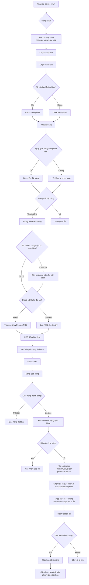

```mermaid
flowchart TD
A[Truy cập bc.one-id.vn] --> B{Đăng nhập}
B --> C[Chọn chương trình TPBANK MUA SẮM VPP]
C --> D[Chọn sản phẩm]
D --> E[Chọn chi nhánh]
E --> F{Đã có địa chỉ giao hàng?}
F -- Có --> G[Chỉnh sửa địa chỉ]
F -- Không --> H[Thêm mới địa chỉ]
G --> I[Vào giỏ hàng]
H --> I
I --> J{Ngày giao hàng đúng điều kiện?}
J -- Có --> K[Xác nhận đặt hàng]
J -- Không --> L[Hệ thống tự chọn ngày]
K --> M{Trạng thái đặt hàng}
L --> M
M -- Thành công --> N[Thông báo thành công]
M -- Lỗi --> O[Thông báo lỗi]
N --> P{Đã có nhà cung cấp cho sản phẩm?}
P -- Chưa có --> Q[Gán nhà cung cấp cho sản phẩm]
P -- Đã có --> R{Đã có NCC cho địa chỉ?}
R -- Chưa có --> S[Gán NCC cho địa chỉ]
R -- Đã có --> T[Tự động chuyển sang NCC]
T --> U[NCC tiếp nhận đơn]
S --> U
Q --> R

U --> V[NCC chuyển trạng thái đơn]
V --> W[Đã đặt đơn]
W --> X[Đang giao hàng]
X --> Y{Giao hàng thành công?}
Y -- Thất bại --> Z[Giao hàng thất bại]
Y -- Đã giao --> AA[Xác nhận tình trạng giao hàng]
AA --> AB{Kiểm tra đơn hàng}
AB -- Đủ --> AC[Xác nhận giao đủ]
AB -- Lỗi --> AD[Xác nhận giao Thiếu/Thừa/Sai sản phẩm/Sai địa chỉ]
AD --> AE[Chọn lỗi: Thiếu/Thừa/Sai sản phẩm/Sai địa chỉ]
AE --> AF[Nhập chi tiết số lượng chênh lệch hoặc mô tả lỗi]
AF --> AG[Hoàn tất báo lỗi]

AG --> AH{Tiến hành bồi thường?}
AH -- Có --> AI[Xác nhận bồi thường]
AI --> AJ[Cập nhật trạng thái sản phẩm: Đã xác nhận]
    AH -- Không --> AK[Chờ xử lý tiếp]
```